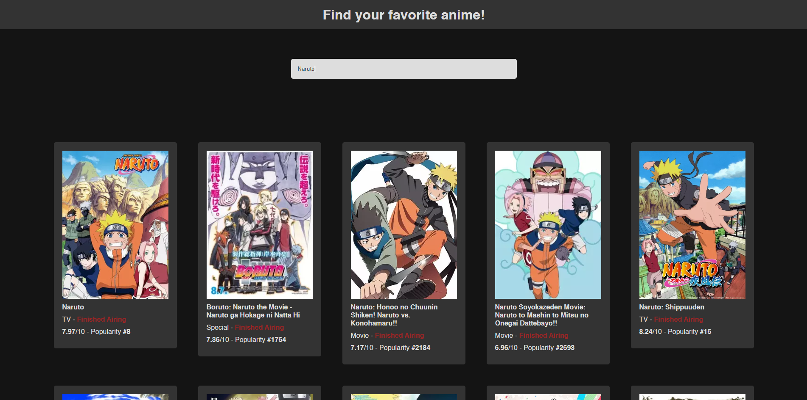

  <h3><a target="_blank" href="https://fastory.bdph.me">Vue Anime</a> · Thierry Maignan</h3>
  

### Fonctionnalités

- Recherche d'un anime
- Page dédiée pour chaque résultat
- Router avec vue router
- Utilisation de l'api [Jikan](https://docs.api.jikan.moe/)

## Description

Site permettant de rechercher un anime parmi l'api Jikan et de découvrir les informations à propos de celui-ci avec un lien vers anime pour plus d'information.